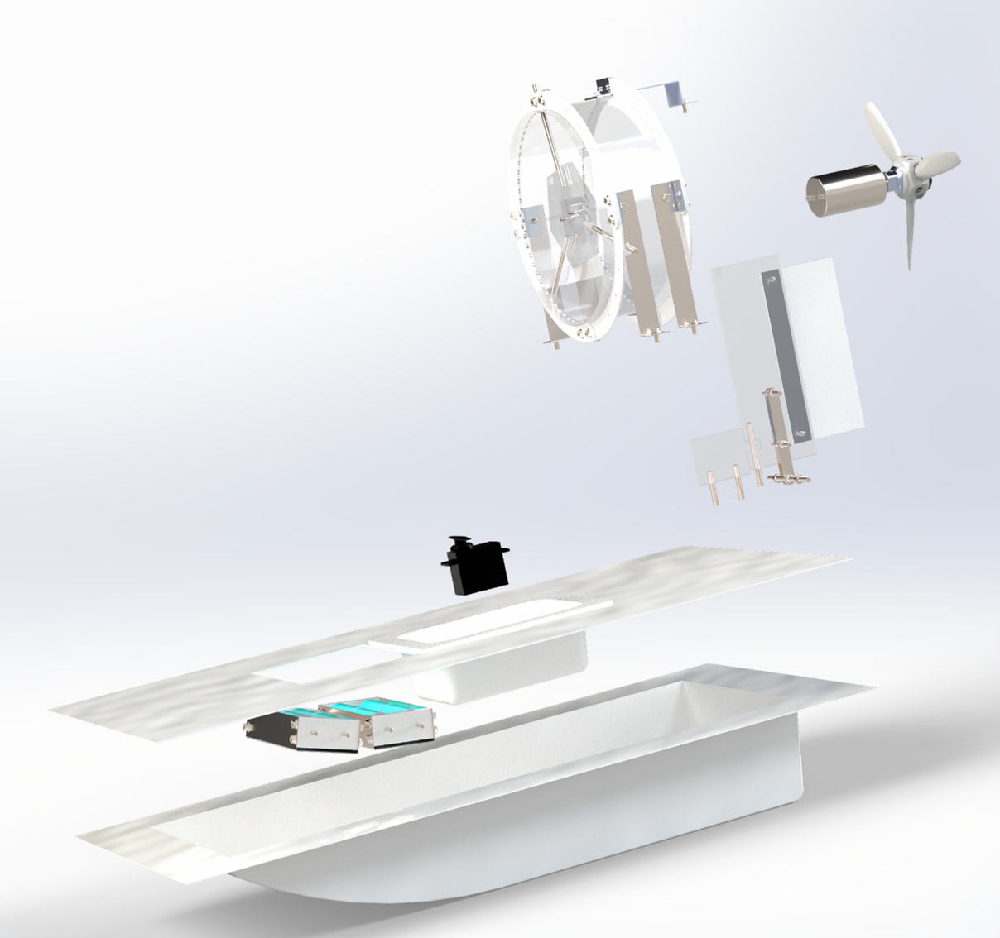
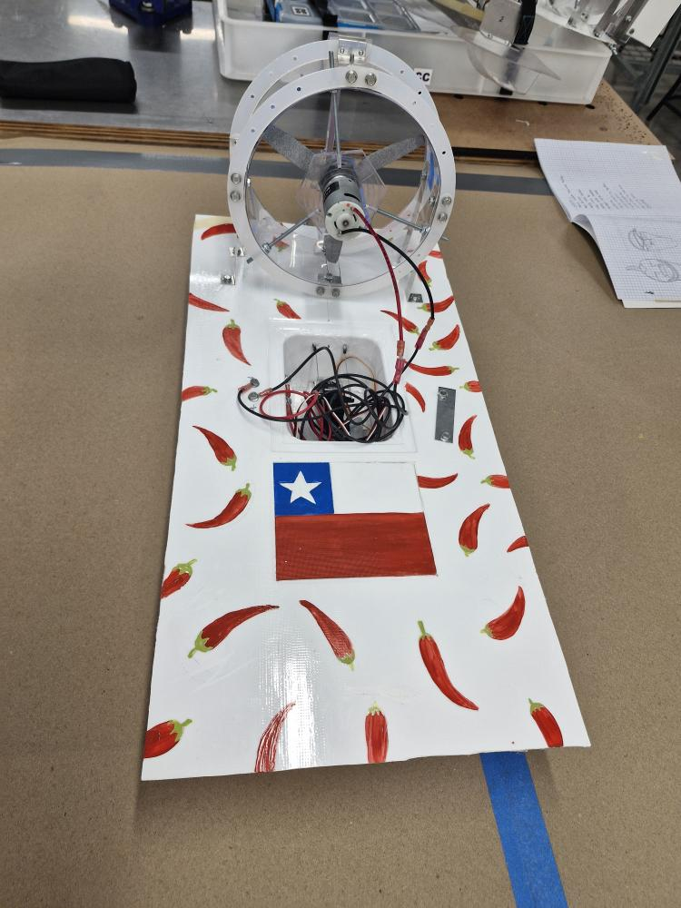
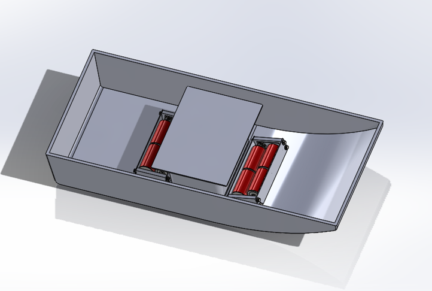
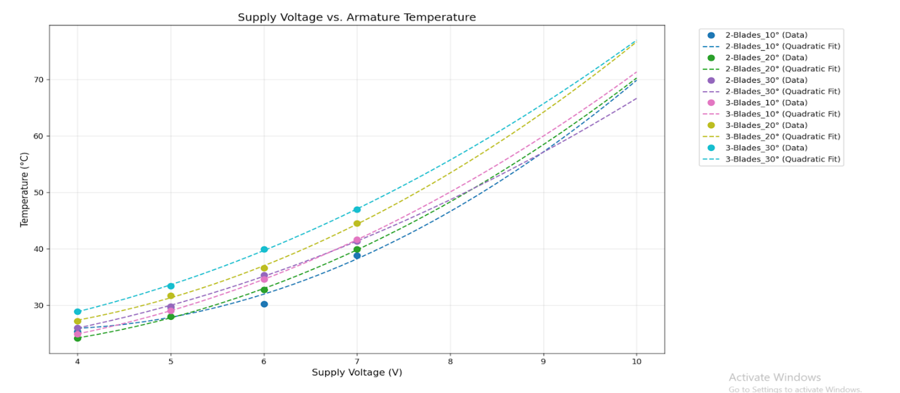
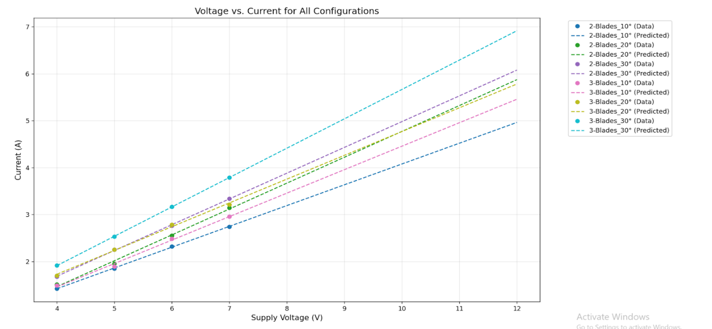

# RC-Boat-Project
Collaborated in a team of 8 to design and manufacture a high-performance battery powered RC race boat at the University of Waikato. 

I was responsible for the designing and implementing the electronics, wiring and the battery packs aswell as our groups' accounting work.

